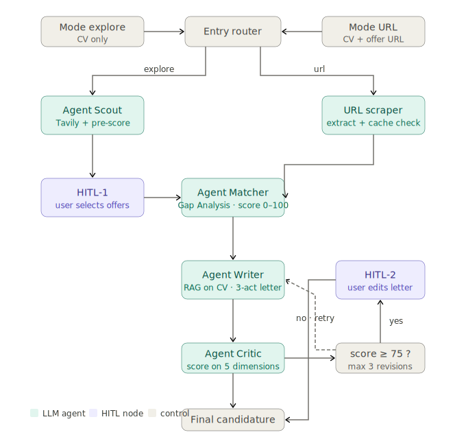
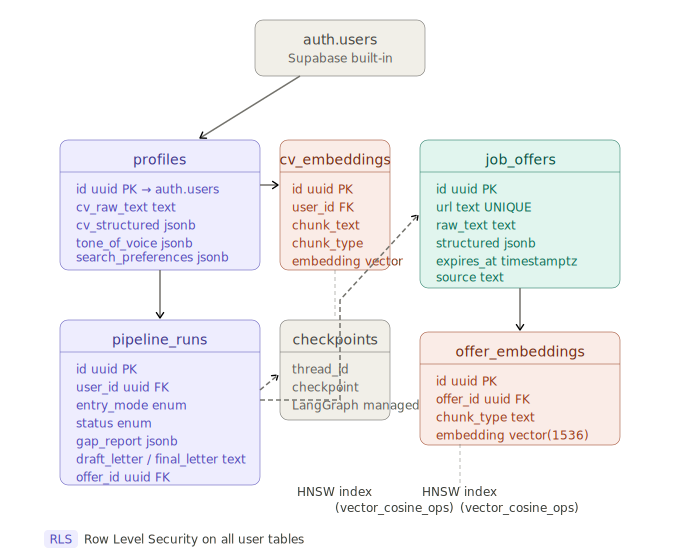

# CareerAgent — Système Multi-Agents d'Assistance aux Candidatures

## Vue d'ensemble

CareerAgent est une application web qui aide les candidats à optimiser leur recherche d'emploi grâce à une architecture multi-agents LLM. Le système analyse sémantiquement le profil d'un candidat face à des offres d'emploi, identifie les écarts de compétences, et génère des lettres de motivation personnalisées avec validation humaine à chaque étape clé.

---
## Stack technique

| Couche | Technologie |
|---|---|
| Backend | Python, FastAPI, LangGraph, LangChain |
| Frontend | Next.js (App Router), TypeScript, Tailwind CSS, shadcn/ui |
| Base de données | Supabase (PostgreSQL + pgvector + Auth + Storage) |
| LLM | OpenAI GPT-5-mini (agents), text-embedding-3-small (embeddings) |
| Recherche web | Tavily Search API |

---

## Architecture





## Fonctionnalités

### Deux modes d'entrée

**Mode URL** — L'utilisateur fournit le lien direct d'une offre.
Le système extrait le contenu (tavily extract), lance immédiatement l'analyse et saute la phase de recherche.

**Mode exploration** — L'utilisateur soumet uniquement son CV.
Le système recherche automatiquement des offres pertinentes via Tavily, les pré-score sémantiquement, et présente la liste à l'utilisateur pour sélection avant de continuer.

### Pipeline multi-agents

```
Entrée → [Routeur] → Scout (explore) ──HITL-1──→ Matcher → Writer → Critic
                  └→ Scraper (url) ──────────────↗                      ↓
                                                               score ≥ 75 ?
                                                              Non → Writer (max 3x)
                                                              Oui → HITL-2 → Fin
```

- **Agent Scout** : recherche Tavily + cache TTL 7 jours dans `job_offers`
- **Agent Matcher** : Gap Analysis sémantique via pgvector (score 0–100)
- **Agent Rédacteur** : génère une lettre en 3 actes via RAG sur le CV
- **Agent Critique** : évalue sur 5 dimensions, route vers révision ou validation

### Human-in-the-Loop (HITL)

- **HITL-1** (mode explore) : l'utilisateur choisit parmi les offres pré-scorées
- **HITL-2** : l'utilisateur révise la lettre générée avant finalisation
- Les corrections HITL-2 alimentent la mémoire de style (*Tone of Voice*) pour les prochaines générations

---

## Base de données — schéma

| Table | Rôle |
|---|---|
| `profiles` | Profil candidat, CV parsé, tone of voice |
| `job_offers` | Offres collectées avec TTL (`expires_at`) |
| `pipeline_runs` | État de chaque run (statut, gap report, lettres) |
| `cv_embeddings` | Vecteurs des chunks CV par utilisateur |
| `offer_embeddings` | Vecteurs des chunks d'offres |
| `checkpoints` | État LangGraph sérialisé (géré par langgraph-checkpoint-postgres) |

Toutes les tables utilisateurs ont **Row Level Security (RLS)** activé.
Les embeddings utilisent l'index **HNSW** de pgvector avec `vector_cosine_ops`.

---

## Variables d'environnement

**Backend (`backend/.env`) :**
```
OPENAI_API_KEY=
TAVILY_API_KEY=
SUPABASE_URL=
SUPABASE_SERVICE_KEY=        # service_role — jamais exposé côté client
SUPABASE_DB_URL=             # postgresql://... connexion directe pour checkpointer
FRONTEND_URL=http://localhost:3000
```

**Frontend (`frontend/.env.local`) :**
```
NEXT_PUBLIC_SUPABASE_URL=
NEXT_PUBLIC_SUPABASE_ANON_KEY=
NEXT_PUBLIC_API_URL=http://localhost:8000
```

---

## Standards de développement

### Général

- Tout le code est en **anglais** (variables, fonctions, commentaires, commits)
- Les messages de commit suivent **Conventional Commits** : `feat:`, `fix:`, `chore:`, `docs:`, `test:`
- Aucune valeur en dur (*hardcoded*) dans le code — tout passe par la config ou les variables d'environnement
- Pas de `print()` ni de `console.log()` en production — utiliser les loggers dédiés

### Backend Python

- **Style** : PEP 8, formaté avec `black`, lint avec `ruff`
- **Types** : typage statique complet — toutes les fonctions ont des annotations de type, `mypy` doit passer sans erreur
- **Fonctions** : une fonction = une responsabilité. Maximum 30 lignes. Si plus, décomposer.
- **Async** : toutes les opérations I/O (appels API, base de données) sont `async/await`
- **Erreurs** : ne jamais swallow une exception. Utiliser des exceptions custom héritant de `Exception`, les logger, et retourner des réponses HTTP explicites
- **Dépendances FastAPI** : injecter les clients (Supabase, checkpointer) via `Depends()`, jamais en variable globale
- **Configuration** : centralisée dans `config.py` via `pydantic-settings`. Aucun `os.getenv()` ailleurs
- **Prompts LLM** : stockés comme constantes dans le module de l'agent correspondant, jamais inline dans la logique métier

### Frontend TypeScript

- **Style** : ESLint + Prettier, zéro `any` toléré
- **Composants** : un fichier = un composant. Taille max recommandée : 150 lignes
- **State** : pas de state global inutile — préférer le state local React ou TanStack Query pour le state serveur
- **Appels API** : centralisés dans `lib/api.ts`. Aucun `fetch` direct dans les composants
- **Types** : tous les types partagés dans `lib/types.ts`. Les types Supabase sont générés via la CLI (`supabase gen types`)
- **Authentification** : toujours via les helpers `supabase/server.ts` dans les Server Components et Route Handlers. Jamais stocker le token manuellement
- **Formulaires** : `react-hook-form` + `zod` pour toute validation

### Base de données

- Toute modification de schéma passe par une **migration numérotée** dans `supabase/migrations/`
- Ne jamais modifier une migration déjà appliquée — créer une nouvelle migration
- Chaque table exposée aux utilisateurs a **RLS activé** avec des policies explicites
- Les fonctions SQL (ex : `match_cv_embeddings`) sont versionnées dans les migrations

### Tests

- **Backend** : `pytest` + `pytest-asyncio`. Chaque module dans `tools/` et `agents/` a son fichier de test correspondant dans `tests/`
- Les appels externes (OpenAI, Tavily, Supabase) sont **mockés** dans les tests unitaires
- **Frontend** : pas de tests E2E pour le PoC — se concentrer sur la validation manuelle des deux flows complets
- Un test doit être lisible sans contexte : nommer clairement selon le pattern `test_<fonction>_<scenario>_<résultat_attendu>`

---
